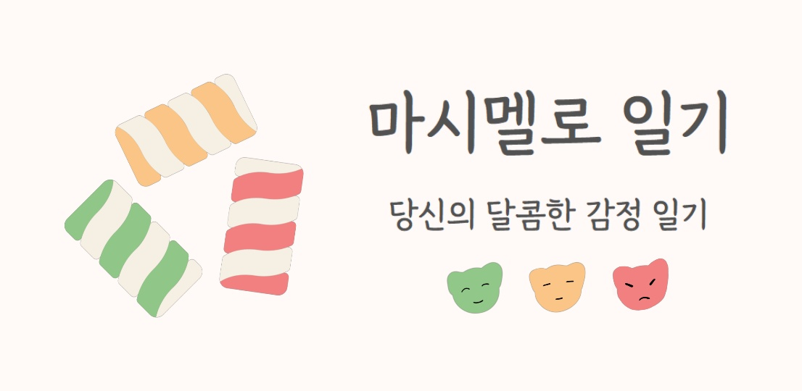

# 마시멜로 일기

### 당신의 달콤한 감정일기!📒💞

### 마시멜로 일기와 함께 달콤한 하루 기록을 시작하세요! 🍭🍬


## :scroll: 목차

- [프로젝트 정보](#zero-프로젝트-정보)
- [프로젝트 개요](#one-프로젝트-개요)
- [팀원 소개](#two-팀원-소개)
- [와이어 프레임 및 디자인 컨셉](#three-와이어-프레임-및-디자인-컨셉)
- [ERD](#four-erd)
- [REST API](#five-rest-api)
- [Git 협업 컨벤션](#six-git-협업-컨벤션)
- [기술 스택 및 아키텍쳐](#seven-기술-스택-및-아키텍쳐)
- [파일 구조](#eight-파일-구조)
- [포팅 메뉴얼](#nine-포팅-메뉴얼)
- [서비스 화면](#🔟-서비스-화면)
- [발표 자료](#star2-발표-자료)
- [자료 출처](#star2-자료-출처)

---


## 마시멜로 일기

### :zero: 프로젝트 정보

- 삼성청년SW아카데미(SSAFY) 7기 2학기 자율프로젝트
- 서울 자율 3반 3팀 (A303)
- 진행기간
  - 2022.10.10 ~ 2022.11.21 (총 7주)

---


### :one: 프로젝트 개요

- **Naver CLOVA Sentiment API를 활용한 감정 분석 일기 서비스** :four_leaf_clover:
- 매일 기록한 일기가 어떤 감정들로 구성되어있는지 알려주고, 사용자는 해당 결과를 기반으로 노래를 추천 받을 수 있습니다.
- 직관적이면서도 감성을 살린 귀여운 UI를 통해 사용자 접근성을 높이고 일기 쓰는 즐거움을 더했습니다.
- 감정 분석 레포트를 통해 월별 감정 비율 분석 그래프를 제공합니다.
- 선택한 기간에 작성한 일기 중 가장 긍정적인 감정으로 이루어진 긍정일기로 다시 안내하는 리마인드 기능을 통해, 과거의 일기를 다시보며 추억할 수 있습니다.
- 당일 일기 분석 결과와 레포트를 이미지로 공유하고 저장 가능합니다.
- 원하는 일기를 검색할 수 있는 검색 기능을 제공합니다.
- 개인 프라이버시 보호를 위한 비밀번호 설정 기능을 제공합니다.

---


### :two: 팀원 소개

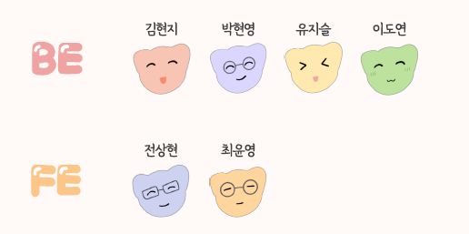

#### 7기 서울 자율 3반 A303

> | 소개                  | 이름   | 담당 파트                                                   |
> | --------------------- | ------ | ----------------------------------------------------------- |
> | :yellow_heart:팀장    | 최윤영 | `FE` 다이어리 작성 및 조회, 다이어리 분석 및 추천, 환경설정 |
> | :heart:팀원           | 김현지 | `BE` 다이어리 작성 및 조회, 검색                            |
> | :purple_heart:팀원    | 박현영 | `BE` 회원가입 및 로그인, 회원 정보 관리                     |
> | :sparkling_heart:팀원 | 유지슬 | `BE` 다이어리 감정 분석 및 결과 조회                        |
> | :green_heart:팀원     | 이도연 | `BE` 서버 배포 및 테스트 코드 작성                          |
> | :blue_heart:팀원      | 전상현 | `FE` 회원가입/로그인, 메인, 분석/통계, 검색                 |

---


### :three: 와이어 프레임 및 디자인 컨셉

- 개발 전 충분한 회의를 거쳐 구현할 핵심 기능 및 캐릭터 디자인, 색상팔레트를 선정하여 추후 개발과정에서 디자인이 크게 변동되어 발생할 수 있는 번거로움과 혼동을 줄였습니다.

> #### 초기 와이어프레임 및 캐릭터 디자인
>
> 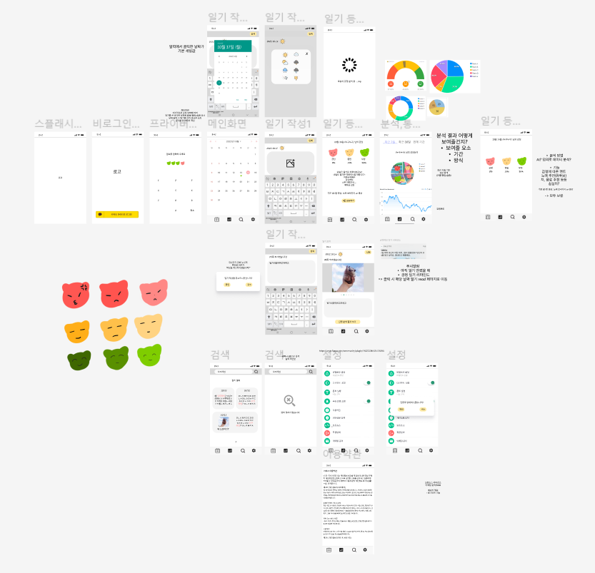

> #### 최종 스토리보드 및 디자인 코드
>
> 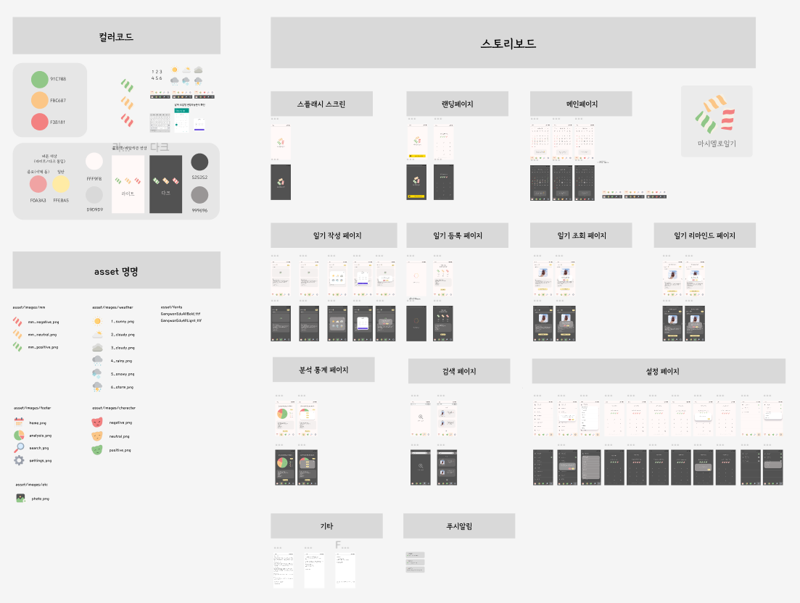
>
> - **Figma 퍼블릭 링크**
>   - https://www.figma.com/file/ZxDkVhHofH1AItO6pzmRNd/A303_public?node-id=0%3A1&t=YSHNI3mXkQWmxDVv-1

---


### :four: ERD

> 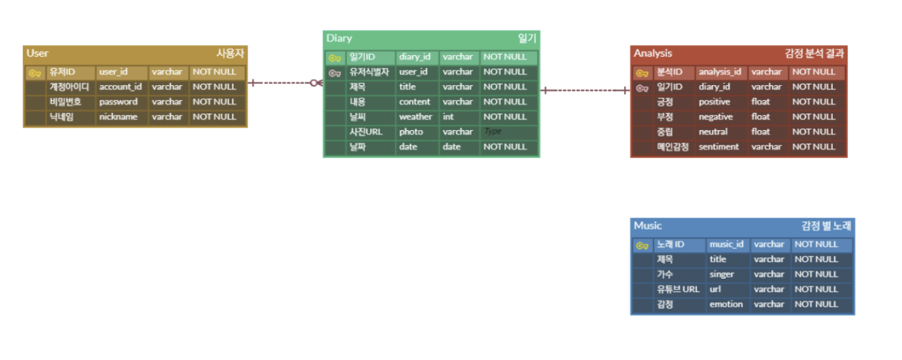

---


### :five: REST API

- 팀 노션 문서를 통해 FE와 BE간의 원활한 확인 및 작업이 가능하도록 했습니다.
- **REST API 퍼블릭 링크**
  - https://www.notion.so/marshmallowdiary/REST-API-1ca16d88bfb94dbfa96ffa39403044a5

> 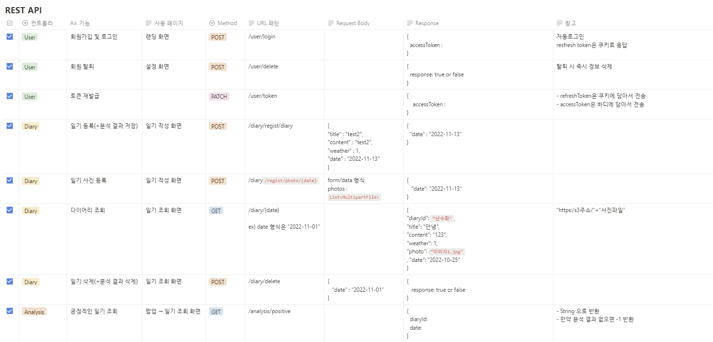
>
> 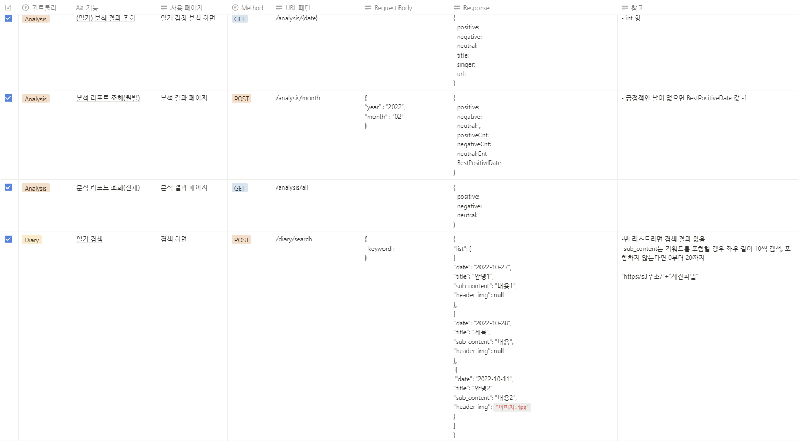
>
> 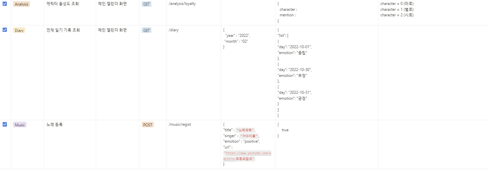

---


### :six: Git 협업 컨벤션

#### 브랜치 명 컨벤션

- `master` -> `develop` -> `front/back` -> `feat`
- 기능별 브랜치 분리가 원칙
- feat보다 상위 브랜치로 merge 진행시 팀원간 상호 확인 필수


#### commit 컨벤션

```text
# type : 제목
# init : 초기 설정 (환경 설정 등)
# feat : 기능 추가
# fix : 버그 수정
# refactor : 리팩토링
# docs : 문서 작업 (문서 추가, 수정, 삭제 등)
# test : 테스트 코드 (테스트 코드 추가, 수정, 삭제)
# chore : 기타 변경사항 (빌드 스크립트 수정 등)
```

---


### :seven: 기술 스택 및 아키텍쳐

> 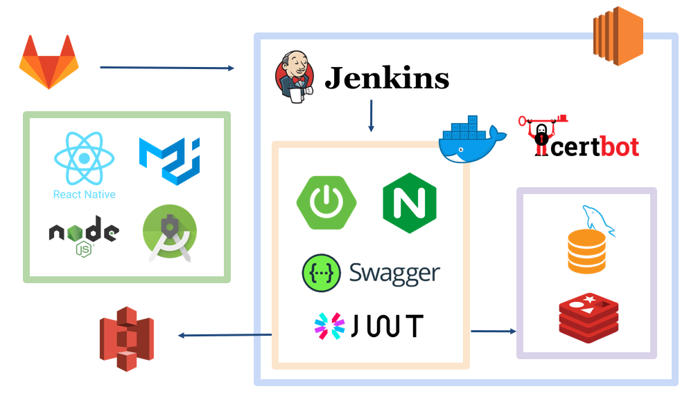

> #### 협업툴
>
> |  GitLab   |     Jira      |     Notion     |    Figma    | Mattermost, Webex |
> | :-------: | :-----------: | :------------: | :---------: | :---------------: |
> | 버전 관리 | 프로젝트 관리 | 공용 문서 관리 | 디자인 협업 | 연락 및 화상회의  |
>
> #### FrontEnd - React Native (JavaScript)
>
> | React Native | Node.js | Chocolatey | Android Studio | SDK | VS code |
> | :----------: | :-----: | :--------: | :------------: | :-: | ------- |
> |    0.70.5    | 16.16.0 |   1.2.0    |    Dolphin     | 31  | 1.73.1  |
>
> #### BackEnd - Spring Boot (Java)
>
> |         Java          | SpringBoot Security | Spring Data JPA | Spring Web | Gradle |
> | :-------------------: | :-----------------: | :-------------: | :--------: | :----: |
> | 11.0.17 (corretto-11) |        2.7.5        |        -        |     -      |  7.5   |
>
> | Swagger | QueryDsl | MySQL  | Redis | MongoDB | IntelliJ IDEA |
> | :-----: | :------: | :----: | :---: | :-----: | :-----------: |
> |  2.9.2  |  1.0.10  | 8.0.30 | 5.0.7 | 4.4.17  |   2022.2.2    |
>
> #### Deploy
>
> | AWS EC2 |    AWS S3    |  Ubuntu   | Docker | Jenkins | Nginx |  Xshell  |
> | :-----: | :----------: | :-------: | :----: | :-----: | :---: | :------: |
> | server  | Image server | 20.04 LTS |        |         |       | 7.0.0025 |

---


### :eight: 파일 구조

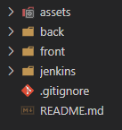

---


### :nine: 포팅 메뉴얼

[Git 내부 링크] 소스 코드 정리 후 추가

---


### 🔟 서비스 화면

> #### 1. 회원가입 및 로그인
>
> 
>
> - 아이디와 비밀번호만 입력하면 쉽고 빠르게 회원가입 할 수 있습니다.
> - 기존회원의 경우 자동으로 로그인이 됩니다.


> #### 2. 홈 화면
>
> 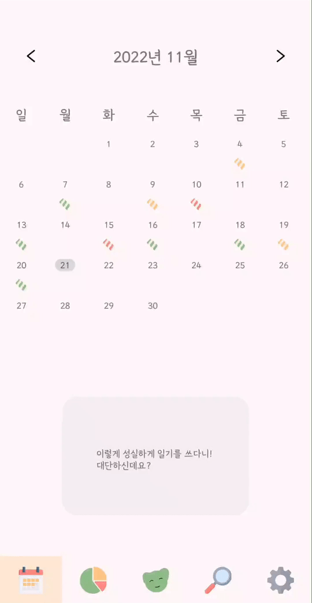
>
> - 그 달의 캘린더와 함께, 일기를 작성한 날짜에 대표 감정에 해당하는 마시멜로가 표시됩니다.
> - 일기를 작성한 날짜를 클릭하면 해당 날짜의 일기를 조회할 수 있습니다.
> - 하단 중앙에는 일기 작성 빈도에 따라 3종류의 캐릭터가 등장하며, 메세지와 함께 일기 작성을 독려합니다.
> - 하단 중앙의 캐릭터를 클릭하면 오늘의 일기를 작성하거나 작성한 일기를 조회할 수 있습니다.


> #### 3. 일기 작성
>
> 
>
> - 일기는 오늘 날짜로만 작성할 수 있습니다.
> - 일기에는 날씨와 제목, 사진과 내용을 등록할 수 있습니다


> #### 4. 일기 조회
>
> 
>
> - 해당 날짜에 작성한 일기의 날씨와 제목, 사진과 내용을 조회할 수 있습니다.
> - 아래의 `분석 결과` 버튼을 통해 감정 분석 결과를 조회할 수 있습니다.


> #### 5. 감정 분석
>
> 
>
> - 작성된 일기를 기반으로 일기 작성자의 감정을 분석합니다.
> - 분석한 감정에 따른 노래를 추천하며, 링크 클릭 시 유튜브로 이동됩니다.


> #### 6. 감정 통계
>
> 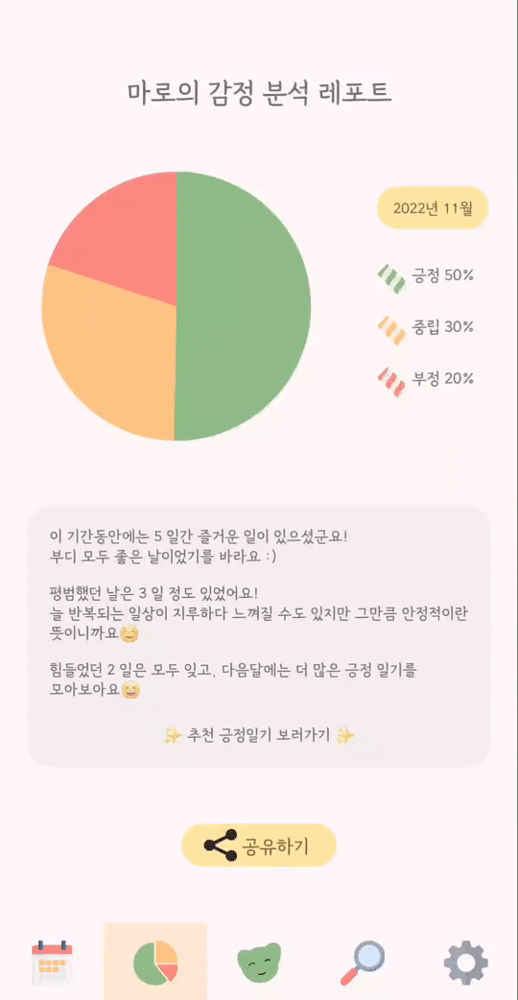
>
> - 한 달 단위 혹은 전체 기간 동안 작성한 일기의 감정 분석 결과 통계를 확인할 수 있습니다.
> - 해당 기간 중 가장 긍정 수치가 높았던 일기를 다시 볼 수 있는 링크를 제공합니다.


> #### 7. 공유하기
>
> 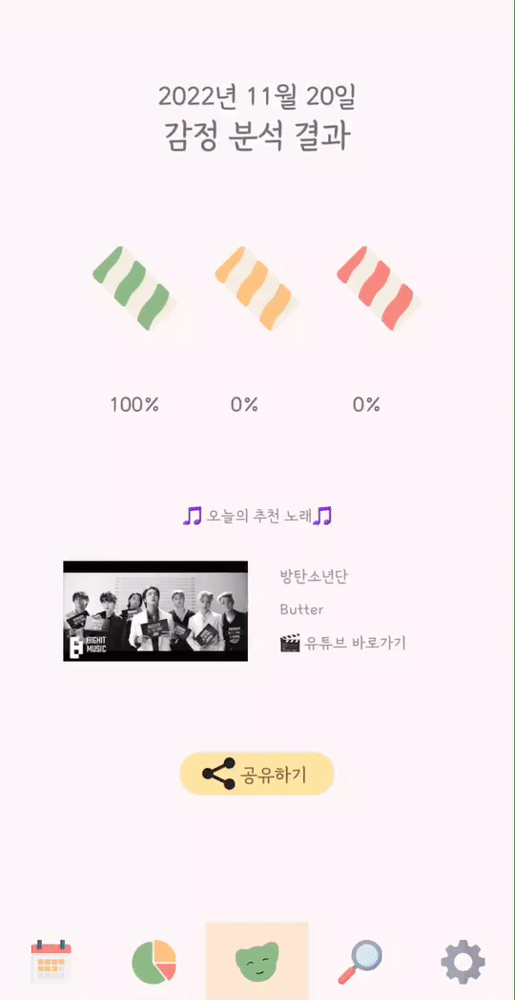
>
> - 그날의 감정 분석 결과, 전체 통계 그래프를 카카오톡, 메시지, 메일 등 다양한 플랫폼을 통해 이미지로 공유할 수 있습니다.


> #### . 검색하기
>
> 
>
> - 다시 보고 싶은 일기를 키워드로 검색할 수 있습니다.


> #### 9. 비밀번호 설정
>
> 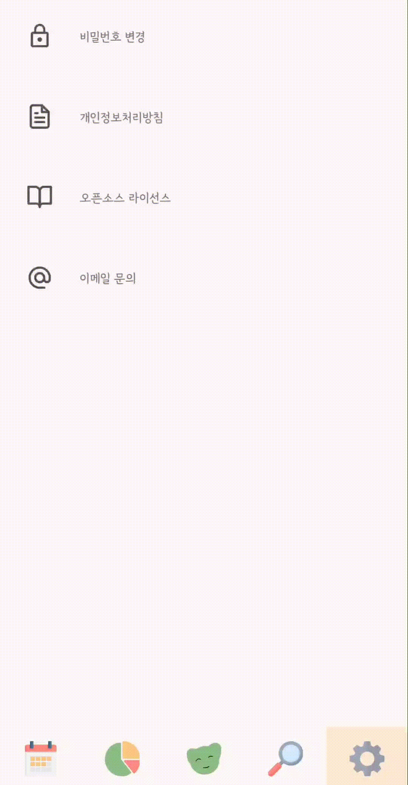
>
> - 사생활 보호에 신경 쓰시는 분이라면 추가적인 비밀번호 설정을 통해 프라이버시 보호를 강화할 수 있습니다.

---


## :star2: 발표 자료

### 중간 발표

[서울_3반_A303_중간발표자료.pdf](assets\서울_3반_A303_중간발표자료.pdf) 

### 최종 발표

[서울_3반_A303_최종발표자료.pdf](assets\서울_3반_A303_최종발표자료.pdf) 

---


## :star2: 자료 출처

- Flaticon : 각종 아이콘 asset
  - https://www.flaticon.com/authors/freepik
- 폰트
  - 강원교육모두체 (Bold, Light)
    - https://blog.naver.com/happygwedu/221897547714
